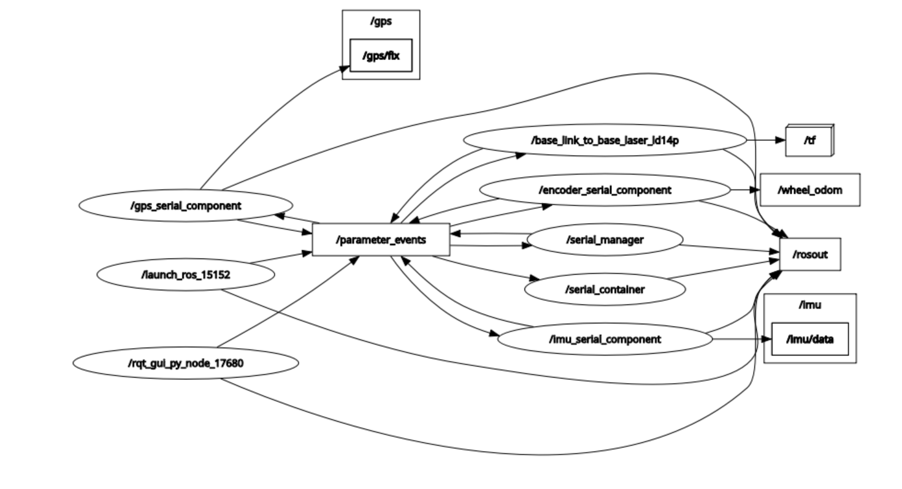

# ROS2 FollowBot
Welcome to the ROS2 FollowBot repository that aligns with our master repository, FollowBot! This repository
is dedicate to creating packages for the robotic side of FollowBot. Below, you'll find an overview of the basic ROS2 
commands and essential information to get started with developing for FollowBot.


### Plans for development:
We will be developing a learning model that enables FollowBot to follow the user using computer vision technologies. By implementing [You Only Look Once (YOLO)](https://docs.ultralytics.com), we will process images as features within our model to allow the device to effectively track and follow the user. 
<br>  


Additionally, we will integrate the `slam-toolbox`, `robot_localization`, and `nav2` packages. This will enable FollowBot to better understand its surroundings and navigate to target locations on campus. 
<br>  


### Current Development Updates:
1. **Arduino and Raspberry Pi Communication**

Sensor data (e.g., wheel encoders, IMU) is transmitted from the Arduino to the Raspberry Pi over a shared serial port. To avoid data collisions, the system uses:
* Thread synchronization: concurrent access to the serial port is managed via multithreading.
* and Demultiplexing: raw sensor data streams are split into separate topics (e.g., /wheel_odom, /imu/data).

We can visualize how these nodes interact, as well as critical topics, via the `rqt_graph`:


2. **Transform Tree** The image below demonstrates the aligned transformations necessary for our mapping to function effectively. Our setup includes the following frame hierarchy: **map → odom → base_link → base_laser**.


* **map**: global fixed frame (for SLAM/navigation)
* **odom**: drift-prone odometry frame (fused by robot_localization)
* **base_link**: robot's base frame
* **base_laser**: position and orientation of a LiDAR sensor
  
<br>

3. **`slam_toolbox` Integration**

Used for [real-time 2D SLAM (Simultaneous Localization and Mapping)](https://github.com/SteveMacenski/slam_toolbox). It processes LiDAR scans and odometry to generate a static map (/map topic) and updates the robot’s pose (/amcl_pose).


4. **`robot_localization` Integration**

Fuses wheel odometry (/wheel_odom), IMU (/imu/data), and GPS (/gps/fix) into a unified odometry estimate (/odometry/filtered) using an Extended Kalman Filter (EKF).


5. **`nav2` Integration**

Handles autonomous navigation:
* Accepts goals via /goal_pose
* Plans paths and executes velocity commands via /cmd_vel
* Relies on the /map and /amcl_pose topics for localization


Our next steps include:
* developing the navigation flow for target coordinates to be delivered to /goal_pose
* developing motion controllers that respond to /cmd_vel

More detailed information about our research can be found at [ROS2 Command List](https://github.com/FrankVanris2/ROS2_FollowBot/blob/master/Documentation/ROS2_Important_Commands.md) (we didn't know where else to include it).

## Prerequisites
* **Raspberry Pi**: Ensure you have a Raspberry Pi 4 or better with more than 4GB of RAM.
* **ROS2**: You must be using the latest version of ROS2, which is Jazzy.
* **Languages**: Developers can create packages in either C++ or Python.

### Basic ROS2 Commands
Here are some fundamental commands to help you get started with ROS2:

### Setup and Initialization
* **Source ROS2 Setup Script:**
```bash
source /opt/ros/jazzy/setup.bash
```
Tip: you can also place this in the .bashrc file so you don't have to always type in this command over and over again.

### Important installs that are currently within this project
* **Necessary package/library installs needed:**
```bash
sudo apt install libserial-dev
```
### Creating a New Package
Before creating a new package, ensure you are in the `src` directory of the `FollowBot_AROS2` workspace.

* **C++ Package:**
```bash
ros2 pkg create --build-type ament_cmake my_cpp_package
```

* **Python Package**:
```bash
ros2 pkg create --build-type ament_python my_python_package
```

### Building Packages
* **Build the Workspace:**
```bash
colcon build
```

**Also:**
If you are needing to install an individual package and not all of them at once you can do this command and specifiy which package you want to build
```bash
colcon build --packages-select my_package
```

### Running Nodes
* **Run a C++ Node:**
```bash
ros2 run my_cpp_package my_cpp_node
```
* **Run a Python Node:**
```bash
ros2 run my_python_package my_python_node.py
```

### Listing Nodes
* **List Active Nodes**:
```bash
ros2 node list
```

### Topic Commands
* **List Topics**:
```bash
ros2 topic list
```
* **Echo Topic**:
```bash
ros2 topic echo /topic_name
```

### Service Commands
* **List Services**:
```bash
ros2 service list
```
* **Call a Service:**
```bash
ros2 service call /service_name std_srvs/srv/Empty
```

### Extra Documentation
For more documentation in how to use ROS2 please follow the below links:

[ROS2 Jazzy Documentation](https://docs.ros.org/en/jazzy/Installation.html)

[ROS2 Command List](https://github.com/FrankVanris2/ROS2_FollowBot/blob/master/Documentation/ROS2_Important_Commands.md)

[ROS2 VSCode Development](https://github.com/FrankVanris2/ROS2_FollowBot/blob/master/Documentation/ROS2_VSCodeDev.md)

### Developing for FollowBot:
FollowBot is a smart robotic device that utilizes ROS2, computer vision, and machine learning to follow users and avoid obstacles.
The following steps outline how you can start developing packages:

1. **Clone the Repository**:
```bash
git clone https://github.com/FrankVanris2/ROS2_FollowBot.git
cd ROS2_FollowBot
```
2. **Navigate to the `src` Directory**:
```bash
cd FollowBot_AROS2/src
```
3. **Create a New Package**: Follow the commands above to create either a C++ or Python package.
4. **Build Your Package**: Use the build command to compile your new package.
5. **Run Your Nodes**: Excute your nodes to test their functionality.

We look forward to your contributions and innovations with FollowBot! If you have any questions or ned further assistance, please refer to the ROS2 documentation or contact our development team.
