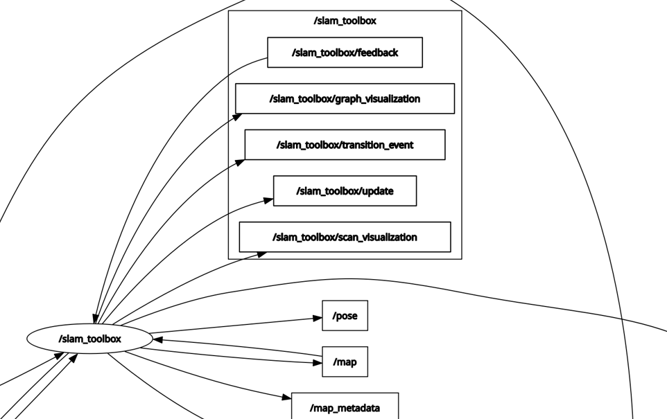

# ROS2 FollowBot
Welcome to the ROS2 FollowBot repository that aligns with our master repository, FollowBot! This repository
is dedicate to creating packages for the robotic side of FollowBot. Below, you'll find an overview of the basic ROS2 
commands and essential information to get started with developing for FollowBot.


### Plans for development:
We will be developing a learning model that enables FollowBot to follow the user using computer vision technologies. By implementing [You Only Look Once (YOLO)](https://docs.ultralytics.com), we will process images as features within our model to allow the device to effectively track and follow the user. 
<br>  


Additionally, we will integrate the `slam-toolbox` and `nav2` packages. This will enable FollowBot to better understand its surroundings and navigate to target locations on campus. 
<br>  


### Current Development Updates:
Over the past couple of months, we have been progressively working on mapping and following mechanics. We utilized SLAM and the SLAM Toolbox to project a map in RViz, a visualization software, enabling us to see our robot in a virtual environment. As of now, we have successfully established connections between our different frames. The image below demonstrates the aligned transformations necessary for our mapping to function effectively. Our setup includes the following frame hierarchy: **map → odom → base_link → base_layer**.


Another representation that provides a clearer understanding is the `rqt_graph`, which illustrates how all our nodes interact with various topics. This visualization highlights the communication flow between nodes and topics in the ROS environment, offering insights into the system's architecture and data exchange.


In this graph, you can observe the nodes interacting with the topics. One of our essential nodes is the SLAM Toolbox, which plays a critical role in mapping. The image below showcases how the SLAM Toolbox updates and projects information to generate the map:



### About SLAM Toolbox:
The SLAM Toolbox is a robust package designed for 2D Simultaneous Localization and Mapping (SLAM) in ROS2. It offers features such as:
- **Lifelong mapping**: Continuously refining and updating maps while removing extraneous information from new scans.
- **Pose-graph optimization**: Ensuring accurate localization and mapping through advanced optimization techniques.
- **Synchronous and asynchronous modes**: Allowing flexibility in processing sensor data.
- **RViz integration**: Providing tools for visualizing and manipulating nodes and connections during mapping.

These capabilities make the SLAM Toolbox an essential component for generating and maintaining accurate maps in dynamic environments.

## Prerequisites
* **Raspberry Pi**: Ensure you have a Raspberry Pi 4 or better with more than 4GB of RAM.
* **ROS2**: You must be using the latest version of ROS2, which is Jazzy.
* **Languages**: Developers can create packages in either C++ or Python.

### Basic ROS2 Commands
Here are some fundamental commands to help you get started with ROS2:

### Setup and Initialization
* **Source ROS2 Setup Script:**
```bash
source /opt/ros/jazzy/setup.bash
```
Tip: you can also place this in the .bashrc file so you don't have to always type in this command over and over again.

### Important installs that are currently within this project
* **Necessary package/library installs needed:**
```bash
sudo apt install libserial-dev
```
### Creating a New Package
Before creating a new package, ensure you are in the `src` directory of the `FollowBot_AROS2` workspace.

* **C++ Package:**
```bash
ros2 pkg create --build-type ament_cmake my_cpp_package
```

* **Python Package**:
```bash
ros2 pkg create --build-type ament_python my_python_package
```

### Building Packages
* **Build the Workspace:**
```bash
colcon build
```

**Also:**
If you are needing to install an individual package and not all of them at once you can do this command and specifiy which package you want to build
```bash
colcon build --packages-select my_package
```

### Running Nodes
* **Run a C++ Node:**
```bash
ros2 run my_cpp_package my_cpp_node
```
* **Run a Python Node:**
```bash
ros2 run my_python_package my_python_node.py
```

### Listing Nodes
* **List Active Nodes**:
```bash
ros2 node list
```

### Topic Commands
* **List Topics**:
```bash
ros2 topic list
```
* **Echo Topic**:
```bash
ros2 topic echo /topic_name
```

### Service Commands
* **List Services**:
```bash
ros2 service list
```
* **Call a Service:**
```bash
ros2 service call /service_name std_srvs/srv/Empty
```

### Extra Documentation
For more documentation in how to use ROS2 please follow the below links:

[ROS2 Jazzy Documentation](https://docs.ros.org/en/jazzy/Installation.html)

[ROS2 Command List](https://github.com/FrankVanris2/ROS2_FollowBot/blob/master/Documentation/ROS2_Important_Commands.md)

[ROS2 VSCode Development](https://github.com/FrankVanris2/ROS2_FollowBot/blob/master/Documentation/ROS2_VSCodeDev.md)

### Developing for FollowBot:
FollowBot is a smart robotic device that utilizes ROS2, computer vision, and machine learning to follow users and avoid obstacles.
The following steps outline how you can start developing packages:

1. **Clone the Repository**:
```bash
git clone https://github.com/FrankVanris2/ROS2_FollowBot.git
cd ROS2_FollowBot
```
2. **Navigate to the `src` Directory**:
```bash
cd FollowBot_AROS2/src
```
3. **Create a New Package**: Follow the commands above to create either a C++ or Python package.
4. **Build Your Package**: Use the build command to compile your new package.
5. **Run Your Nodes**: Excute your nodes to test their functionality.

We look forward to your contributions and innovations with FollowBot! If you have any questions or ned further assistance, please refer to the ROS2 documentation or contact our development team.
